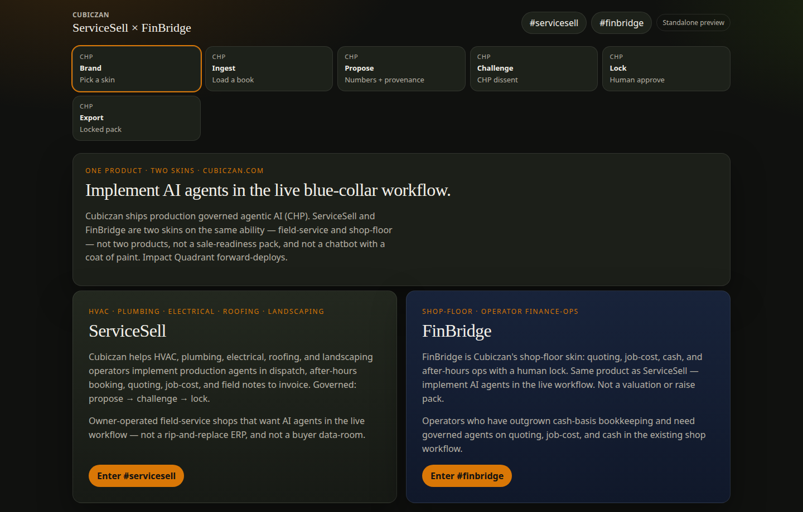
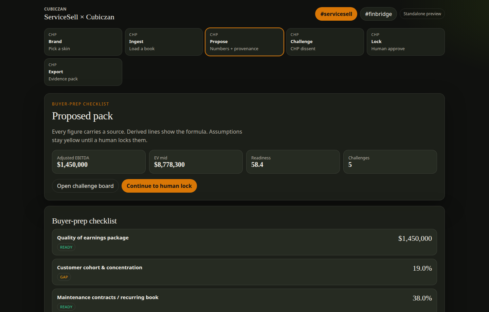
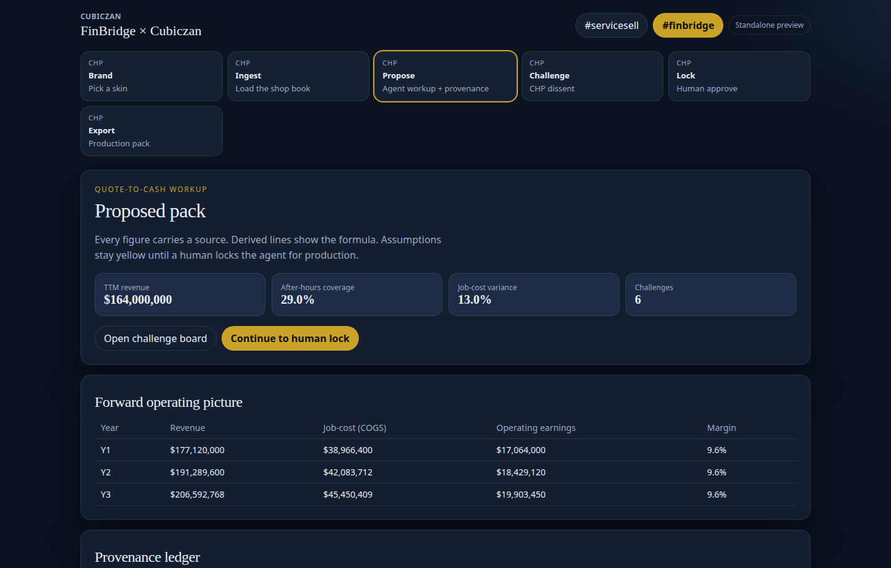
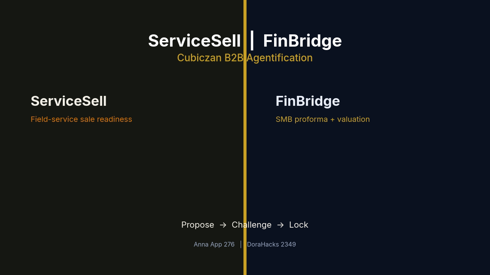

# ServiceSell × FinBridge

**One Cubiczan Anna App. Two brand skins. Same tools.**

Field-service owners and SMB operators still take sale and fundraising numbers out of a bookkeeper file. This console proposes a pack, challenges weak claims, and refuses to export until a human locks every figure.

- **ServiceSell** — field-services companies (~$1M+ EBITDA) preparing to meet institutional buyers (sale readiness / buyer-prep checklist).
- **FinBridge** — SMB owners stepping beyond the bookkeeper: three-year proforma + valuation band for a raise or a sale.

Not two products. `#servicesell` and `#finbridge` are skins on one CHP spine: **propose → challenge → lock**.

| | |
| --- | --- |
| **Anna App id** | **276** |
| **Slug** | `servicesell-finbridge` |
| **License** | [MIT](LICENSE) |
| **Hackathon** | [DoraHacks #2349](https://dorahacks.io/hackathon/2349/buidl) |

**YouTube URL (Sam fills this):** `_https://www.youtube.com/watch?v=YOUR_VIDEO_ID_`

## Repos

- https://github.com/Cubiczan/servicesell-finbridge
- https://github.com/icohangar-ops/servicesell-finbridge

## How AI / Anna is wired

| Layer | What it does |
| --- | --- |
| Structured UI | React console (not a chat skin). Provenance chips on every number. |
| Engine | Deterministic ingest → workup → challenge → lock → export. Runs offline. |
| Executa | Python JSON-RPC tool: `ingest_scenario`, `generate_workup`, `lock_consensus`, `export_summary`. |
| Skill | `SKILL.md` / `executas/chp-workflow/SKILL.md` for `#servicesell` and `#finbridge`. |
| Manifest | `app.json` + schema-2 `manifest.json` UI bundle. Scaffolded with `anna-app init`. |

Every claim is `ingested`, `derived` (formula attached), `assumption`, or `benchmark`. Lock is refused while any claim is still `proposed` or `challenged`.

## How to run

```bash
npm i && npm run preview
# open http://127.0.0.1:43173
# then pick a skin or open #servicesell / #finbridge
```

```bash
npm run dev              # Vite live reload, same port 43173
npm test                 # TS + Python engine
npm run build
npx anna-app validate --strict
npx anna-app dev --port 43180   # official Anna harness (needs uv; no PAT for the offline tool path)
```

No Anna cloud credentials are required for the demo. `anna-app login --host https://anna.partners` is only for live host LLM / APS.

## Judge media

| Asset | Path |
| --- | --- |
| **~180s demo (FFmpeg, H.264)** | [docs/media/demo.mp4](docs/media/demo.mp4) |
| **YouTube thumbnail 1280×720** | [docs/media/thumbnail.png](docs/media/thumbnail.png) |
| Artifact copies | [artifacts/demo.mp4](artifacts/demo.mp4), [artifacts/thumbnail.png](artifacts/thumbnail.png) |

**YouTube URL (placeholder):** `_https://www.youtube.com/watch?v=YOUR_VIDEO_ID_`

### Screenshot gallery

| Skin | Shot | File |
| --- | --- | --- |
| Both | Brand gate | [docs/media/01-brand-gate.png](docs/media/01-brand-gate.png) |
| ServiceSell | Ingest | [docs/media/02-servicesell-ingest.png](docs/media/02-servicesell-ingest.png) |
| ServiceSell | Buyer-prep workup | [docs/media/03-servicesell-workup.png](docs/media/03-servicesell-workup.png) |
| ServiceSell | Challenge board | [docs/media/04-servicesell-challenge.png](docs/media/04-servicesell-challenge.png) |
| ServiceSell | Human lock | [docs/media/05-servicesell-review.png](docs/media/05-servicesell-review.png) |
| ServiceSell | Export | [docs/media/06-servicesell-export.png](docs/media/06-servicesell-export.png) |
| FinBridge | Ingest | [docs/media/07-finbridge-ingest.png](docs/media/07-finbridge-ingest.png) |
| FinBridge | Proforma + valuation | [docs/media/08-finbridge-proforma.png](docs/media/08-finbridge-proforma.png) |
| FinBridge | Challenge | [docs/media/09-finbridge-challenge.png](docs/media/09-finbridge-challenge.png) |
| ServiceSell | Mobile | [docs/media/10-mobile-servicesell.png](docs/media/10-mobile-servicesell.png) |
| FinBridge | Mobile | [docs/media/11-mobile-finbridge.png](docs/media/11-mobile-finbridge.png) |









## DoraHacks #2349 — paste-ready BUIDL

Full paste block: [DORAHACKS.md](DORAHACKS.md).

> ServiceSell × FinBridge is one Cubiczan Anna App with two brand skins — not two products. **Problem:** field-service owners (~$1M+ EBITDA) and SMB operators still sit in bookkeeper spreadsheets when they need a buyer-ready or fundraising-ready pack. **Who:** ServiceSell = field-services companies preparing to meet institutional buyers; FinBridge = SMB owners stepping beyond the bookkeeper for a proforma and valuation band. **How AI / agents work:** a deterministic workup engine (and, on Anna, the bundled Executa) proposes claims with provenance; a rule pack challenges weak numbers; a human must approve or reject every claim before lock and export. **Anna integration:** App id 276, slug `servicesell-finbridge`, schema-2 UI bundle, Python Executa, `#servicesell` / `#finbridge`, SKILL.md. **Run:** `npm i && npm run preview`. **Media:** `docs/media/demo.mp4`, `docs/media/thumbnail.png`, `docs/media/*.png`. **YouTube:** _https://www.youtube.com/watch?v=YOUR_VIDEO_ID_ **Repos:** https://github.com/Cubiczan/servicesell-finbridge · https://github.com/icohangar-ops/servicesell-finbridge

## Brand positioning

Public Facebook bios were not independently retrievable at build time. Copy is from [cubiczan.com](https://www.cubiczan.com) and the product brief.

**Cubiczan** — Agentic finance, fractional CFO, approval gates, evidence packs.  
**ServiceSell** — Sale-readiness for field services.  
**FinBridge** — Governed proforma and valuation band.  
Demo books are **illustrative composites**, not named customers.

## Anna App layout

```
app.json                 listing + bundled Executas (id 276 / slug)
manifest.json            schema 2 UI + host_api ACL
bundle/                  static SPA Anna mounts in the iframe
src/                     React + TypeScript UI (Vite → bundle/)
executas/servicesell-finbridge/   Python CHP tool
executas/chp-workflow/SKILL.md    declarative recipe
docs/media/              demo.mp4, thumbnail, screenshots
artifacts/               copies for judges
```

Docs followed: https://anna.partners/developers · https://anna.partners/llms.txt

## Disclaimer

Illustrative figures only. Not a valuation opinion, offer of securities, or quality-of-earnings report.
